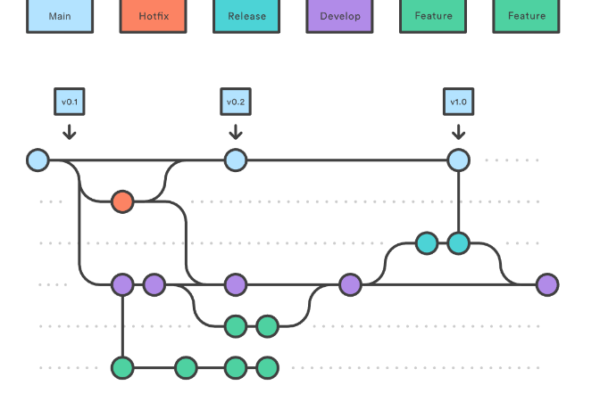
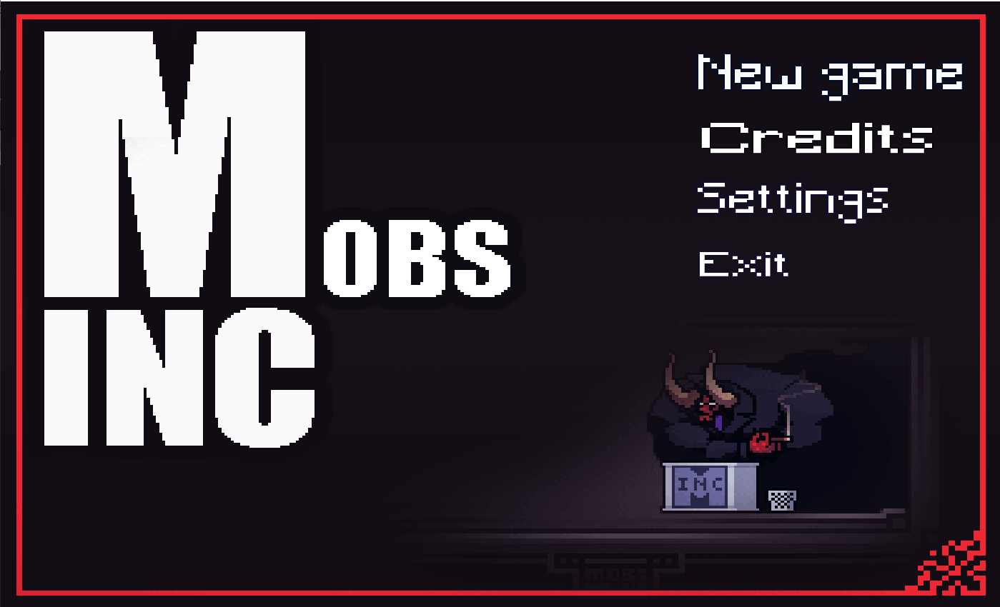
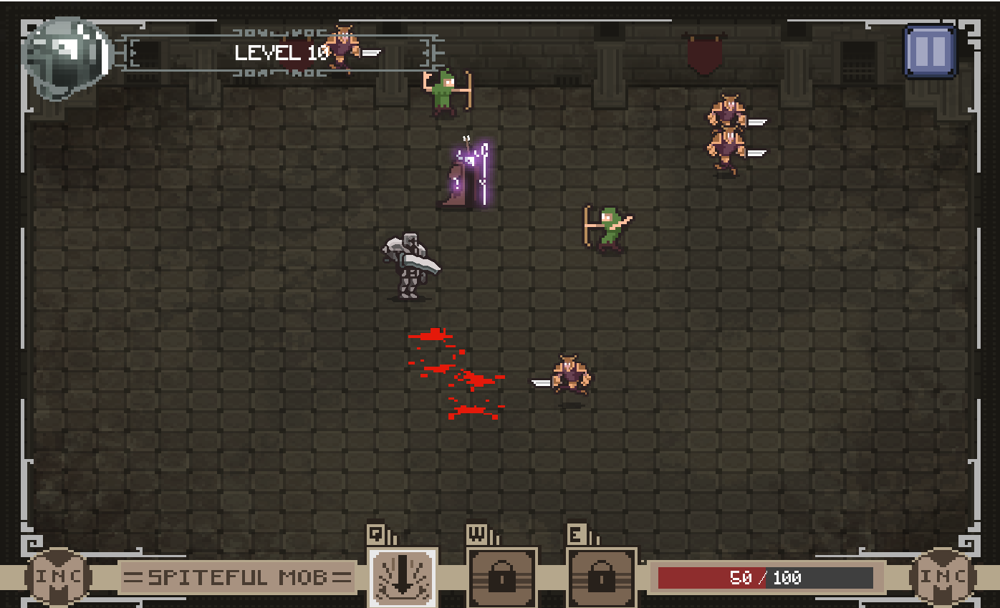
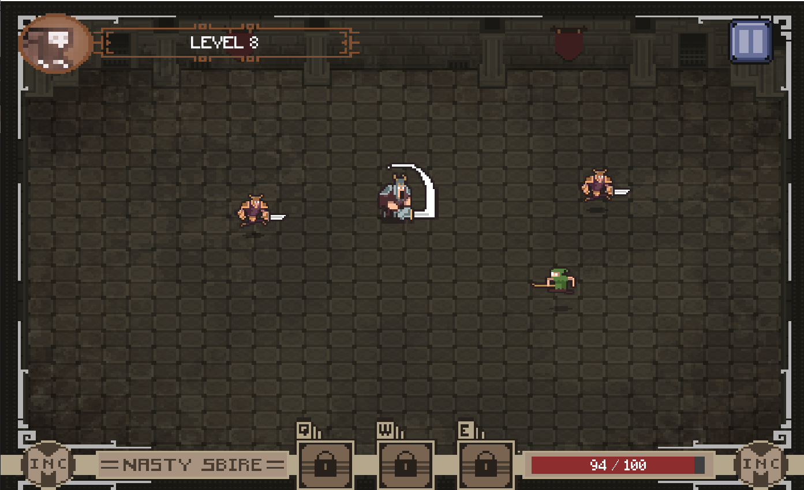
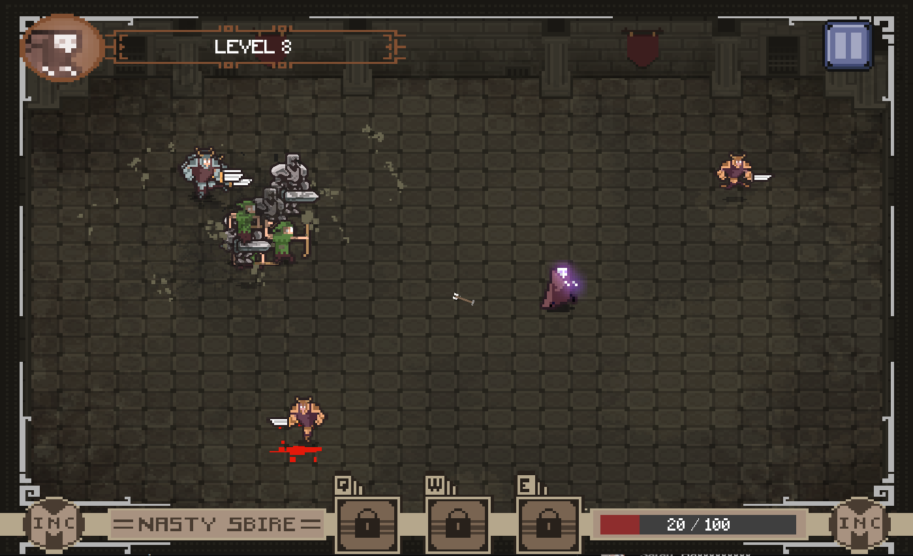
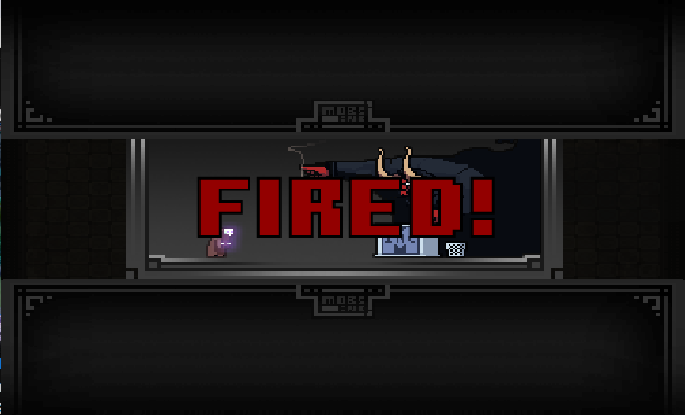
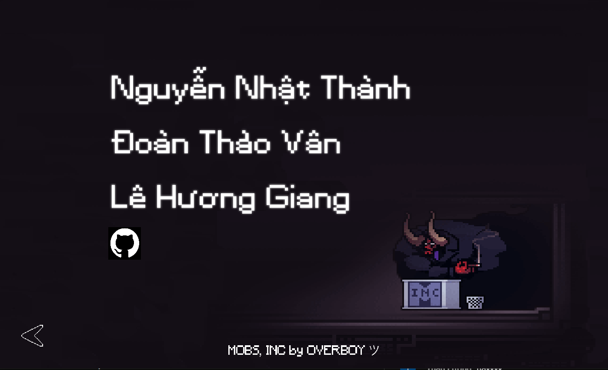

# 1. Group Information 
### Project Name: Not "Mobs Inc"
### Project Link: [Not "Mobs Inc"](https://github.com/NgNhatThanh/ProGamejam_BTCK)
### Group Members
- **Members**:
  - Nguyễn Nhật Thành
  - Lê Hương Giang
  - Đoàn Thảo Vân
- **Mentor**: Nguyễn Quốc Hưng

### Working Model
Team operates according to the Scrum model, using Linear to manage tasks. All tasks are thoroughly kept track on Linear.
- Link Linear: [Linear](https://linear.app/pgjbdtproptit-part2/team/NHOM7/all)

Each week, team will have a meeting to review completed tasks, tackle any remaining problems and propose solutions for the following week.
Then, there will be a demo session with the mentor to receive feedbacks and appropriate guidance in accordance with the team's progress. 

### Version Control Strategy
Team uses Gitflow to manage code. Each member will create a branch from `develop` to work on, naming the branches in the format `feature/function-name`.
Once completing a branch, team will create a Pull Request to review code as well as merge it into `develop`.
- Main branches:
  - `master`: Contains stable code which has been thoroughly tested and reviewed.
  - `develop`: Contains latest code going through the test and review process.
  - `feature`/: Contains ongoing development code, which are short-lived and will be merged into `develop` once completing.

    

At the end of each week, team will merge `develop` into `main/master` to release a new version.

# 2. Project Introduction
   > **Description**: Not "Mobs Inc" is a 1-player game in which the player takes on the role of a monster character working in a dungeon management company.
   The player's mission is to wipe out the adventurers, preventing them from entering the dungeon.
   If the mission is well completed, the player can level up, upgrade skills and unlock more powerful abilities.
   On the contrary, if the mission is failed, the player will be fired by the CEO.

# 3. Main functions
   - **Main character control**: The player will control main a monster to wipe out approaching adventures, protect dungeons from being invaded.
   - **Skills progress**: After destroying a certain number of adventurers, the player will level up and unlock more special and powerful skills.
   - **Slow-motion process**: Game will go through a slow-motion progress when player use their unlocked skills or are killed by the adventures.
# 4. Technology
### 4.1. Used Technologies 
   - Language Programming: Java
   - Framework: LibGDX
   - Gradle
   
### 4.2. Project Structure
```
- assets
    - images
    - sounds
- core
    - common
    - controller
    - model
    - view
    - crowd_control
    - ui
    - utils
- desktop
```
  Explanation:
- **assets**: Contains resources related to images and sounds.
- **core**: Contains main classes such as model, view, controller, common, ui... 
- **desktop**: Contains classes to run on other different platforms.

# 5. Image and Video Demo
- Demo video: [Link](https://www.youtube.com/watch?v=tqEaoUc-8so)
- Demo images:







# 6. Encountered Problems
### Problem 1: Using very small decimal values in a loop to move a character that leads to a program crash.
#### Solution: Change the formula to one that doesn't require a loop

### Problem 2: instantiate Button class too many times in render function that leads to continuous increasement of memory
#### Solution: Reduce the memory usage of Button class by removing abundant properties, and instantiate them only one time with the screen
# 7. Conclusion
After this project, our team does have the opportunity to gain knowledge related to Gitflow, collaboration skill and getting to know how a project can be operated in real life, which remarkably improve the programming skill. Hope everyone will enjoy the game.
Pull requests are welcome. For major changes, please open an issue first to discuss what you would like to change.
